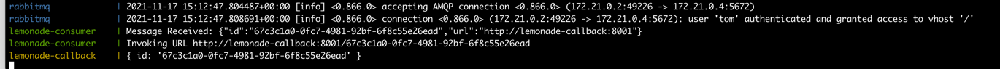
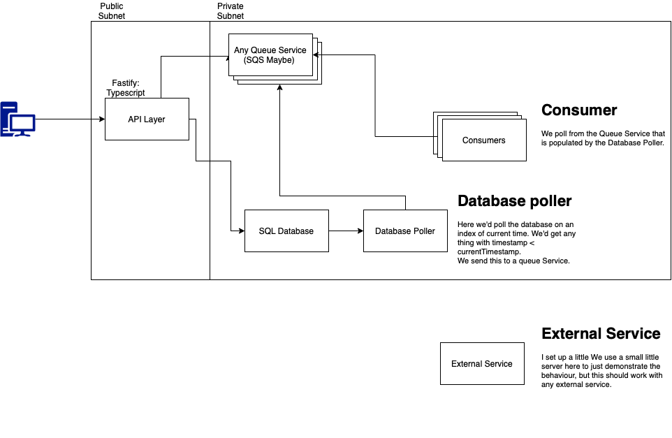

# Timers:  

Setting up timers that call an external endpoint after a period of time. 

Uses Docker and Docker-compose.

## Setup and running  

I have included a shell script: 

./setup.sh 

This goes in and installs dependencies, transpiles the typescript, and builds the Docker Images. 

It then invokes the docker-compose file to start the containers. 

It then waits and creates the dynamoDb Tables. (From Localstack.)

Subsequent runs can be performed with docker-compose up. 

If you rerun the script all data from the queues and tables will be lost. 

The setup will also print the logs.

## Design
The design idea around this assignment is: 

When designing an application, we should rely as heavily as possible on relying on behaviour that is well-tested, and already implemented. 

As such, for my implementation we rely heavily on behaviour built into RabbitMQ. 

While in this version we host our own version of Rabbit MQ (Docker Image). We could instead rely on a managed version of amqp. 
This would also help give us better availability, and allow for better scaling. 

RabbitMQ also has behaviour to ensure just-once delivery of messages. This is important as it would 
easier allow us to scale out the consumer. This should ensure that we have timely delivery as we scale to lots of timers. 

We can also independently scale the API layer.

## Implementation

## Alternative Designs 

We could also rely on a SQL Database to do the same thing. We would have a poller of the database, and everytime we encountered a new timer we would then add it to SQS.  
This would also be easier to coordinate, as if we failed a database write, no invoke would occur. 

However, it'd be more difficult to setup, scale, there'd be issues with locking. 

Other designs would be similar to this, for instance, we could just directly consume from the database. 

## Future improvements. 

* Testing. There's currently no testing.
* Delete Timers - Would require consumer to use Database before invoking, but would be possible. 
* Actual Infrastructure and scaling - We could easily do this. 
* Better error handling in consumer.
